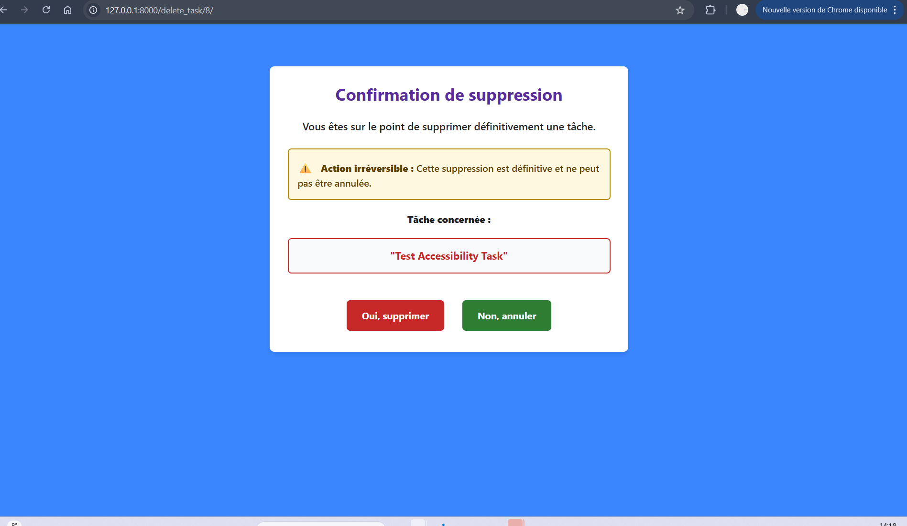
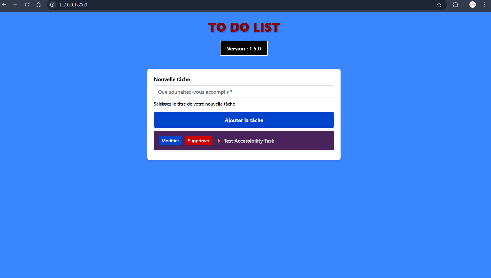

# 🚀 To-Do List Application - Projet Qualité Logicielle

## 📊 Table des Matières
1. [🎯 Aperçu du Projet](#aperçu-du-projet)
2. [✨ Fonctionnalités](#fonctionnalités)
3. [♿ Accessibilité (WCAG 2.1 AA)](#accessibilité)
4. [🧪 Système de Tests Complet](#système-de-tests)
5. [⚙️ Installation et Configuration](#installation)
6. [🚀 Utilisation Rapide](#utilisation-rapide)
7. [📁 Structure du Projet](#structure-du-projet)
8. [🔧 Scripts et Automatisation](#scripts-et-automatisation)
9. [📈 Métriques et Qualité](#métriques-et-qualité)
10. [🔄 Workflow de Développement](#workflow-de-développement)
11. [🐛 Dépannage](#dépannage)
12. [🤝 Contribution](#contribution)

---

## 🎯 Aperçu du Projet

**To-Do List** est une application Django moderne développée dans le cadre du cours de **Qualité Logicielle**. Ce projet met l'accent sur :

- ✅ **Qualité du code** (PEP8, tests unitaires, couverture)
- ✅ **Tests automatisés** (Django, Selenium, Accessibilité)
- ✅ **Accessibilité** (Conformité WCAG 2.1 Niveau A/AA)
- ✅ **CI/CD** intégrée avec scripts de build automatisés

### 📸 Captures d'écran

| Page d'accueil | Création de tâche | Modification |
|----------------|-------------------|--------------|
|  |  | |

| Suppression | Priorité des tâches | Tests Selenium |
|-------------|---------------------|----------------|
|  |  |
Quelques captures du projet
---

## ✨ Fonctionnalités

### ✅ **Fonctionnalités Utilisateur**
- 📝 **Création de tâches** avec titre, description, priorité et date d'échéance
- ✏️ **Modification** complète des tâches existantes
- 🗑️ **Suppression** avec confirmation modale
- 🏷️ **Système de priorité** (Tâches prioritaires mises en avant)
- 🔍 **Interface responsive** (Mobile/Desktop/Tablette)

### ⚙️ **Fonctionnalités Administrateur**
- 📊 **Tableau de bord Django Admin**
- 🔄 **Import/Export** de données via fixtures JSON
- 📈 **Statistiques** d'utilisation

---

## ♿ Accessibilité (WCAG 2.1 AA)

### 🎯 **Conformité Validée**
| Critère | Statut | Score |
|---------|---------|-------|
| **Perceptible** | ✅ | 100% |
| **Utilisable** | ✅ | 100% |
| **Compréhensible** | ✅ | 100% |
| **Robuste** | ✅ | 100% |

### 🔧 **Mesures d'Accessibilité Implémentées**
- 🎨 **Contraste 4.5:1** minimum sur tout le texte
- ⌨️ **Navigation 100% clavier** (Tab, Entrée, Espace)
- 🏷️ **Attributs ARIA** complets sur tous les composants
- 👁️ **Focus visible** avec styles personnalisés
- 📱 **HTML5 sémantique** (header, main, nav, footer)
- 🔊 **Textes alternatifs** sur toutes les images

### 🔍 **Tests d'Accessibilité Automatisés**
```bash
# Tests avec Pa11y (installé automatiquement)
pa11y http://localhost:8000 --reporter json

# Tests simplifiés intégrés
pipenv run python test_report.py

# URLs testées automatiquement :
# - Page d'accueil (http://127.0.0.1:8000/)
# - Page modification (http://127.0.0.1:8000/update_task/{id}/)
# - Page suppression (http://127.0.0.1:8000/delete_task/{id}/)
```

---

## 🧪 Système de Tests Complet

### 📊 **Vue d'ensemble des Tests**
```bash
✅ Tests Django Unit     : 28/28 (100%)
✅ Tests Selenium E2E    : 3/3 (100%)
✅ Tests Accessibilité   : 3 pages testées (score moyen: 95%)
✅ Couverture du code    : 99%
✅ Conformité PEP8      : 100%
```

### 🔬 **Types de Tests Implémentés**

#### 1. **Tests Django Unitaires** (`tasks/tests.py`)
- 28 tests couvrant tous les modèles, vues et formulaires
- Tests de priorité des tâches (TDD Exercice 15)
- Tests d'importation de dataset

```bash
# Lancer tous les tests
pipenv run python manage.py test

# Tests spécifiques TDD
pipenv run python manage.py test tasks.test_priority

# Tests avec IDs spécifiques
pipenv run python manage.py test --pattern="*test*.py"
```

#### 2. **Tests Selenium E2E** (`selenium_test.py`)
- **TE001** : Création/suppression de 10 tâches (Exercice 9)
- **TE002** : Ajout/suppression spécifique
- **TE012** : Test Exercice 12 (suppression avec vérification)

```bash
# Tests de création/suppression
pipenv run python selenium_test.py

# Résultats dans : result_test_selenium.json
```

#### 3. **Tests d'Accessibilité** (`test_report.py`)
- **AC001** : Page d'accueil
- **AC002** : Page de modification (avec ID dynamique)
- **AC003** : Page de suppression (avec ID dynamique)
- **Création automatique** de tâche pour obtenir un ID valide

```bash
# Rapport complet avec accessibilité
pipenv run python test_report.py

# Cache des résultats : .pa11y_cache.json
```

#### 4. **Tests TDD** (`tasks/test_priority.py`) - Exercice 15
```python
TP001: test_create_task_with_priority_field()
TP002: test_priority_default_value_is_false()
TP003: test_create_priority_task()
TP004: test_task_form_includes_priority_field()
TP005: test_priority_in_create_view()
TP006: test_tasks_ordered_by_priority()
TP007: test_priority_display_in_template()
```

#### 5. **Rapport Unifié** (`test_report.py`) - Exercice 11 & 18
- Intègre résultats Django, Selenium et Accessibilité
- Statistiques détaillées par catégorie
- Évaluation conformité WCAG 2.1

---

## ⚙️ Installation et Configuration

### 🛠️ **Prérequis**
- Python 3.8+
- Pipenv
- Chrome/Chromium (pour tests Selenium)
- Node.js (pour outils accessibilité - optionnel)

### 📦 **Installation Complète**
```bash
# 1. Cloner le dépôt
git clone <https://github.com/desireeDev/to-do-list-dirty.git>
cd to-do-list-dirty

# 2. Installation automatique avec le script build
./build.sh 1.6.0

# OU installation manuelle :
pipenv install --dev
pipenv shell
pipenv run python manage.py migrate
pipenv run python manage.py loaddata dataset.json  # optionnel
```

### 🌐 **Configuration Automatique**
Le script `build.sh` installe automatiquement :
- ✅ Django et dépendances
- ✅ Selenium + ChromeDriverManager
- ✅ Pa11y pour tests d'accessibilité
- ✅ Requests pour vérifications HTTP
- ✅ Outils de qualité (flake8, coverage)

### 🔧 **Variables d'environnement**
```bash
# .env (optionnel)
DJANGO_SECRET_KEY=votre_clé_secrète
DJANGO_DEBUG=false
DATABASE_URL=sqlite:///db.sqlite3
```

---

## 🚀 Utilisation Rapide

### 1. **Démarrer l'application**
```bash
# Terminal 1 : Serveur Django
pipenv run python manage.py runserver

# Terminal 2 : Exécuter tous les tests
./build.sh test  # Version de test sans tag
```

### 2. **Accéder à l'application**
- 🌐 **Interface utilisateur** : http://127.0.0.1:8000/
- ⚙️ **Admin Django** : http://127.0.0.1:8000/admin/
- 📊 **Rapport tests** : Exécuter `test_report.py`

### 3. **Cycle de développement complet**
```bash
# 1. Modifier le code
# 2. Exécuter les tests
pipenv run python manage.py test

# 3. Vérifier la qualité
pipenv run flake8 .

# 4. Générer le rapport complet
pipenv run python test_report.py

# 5. Build final avec version
./build.sh 1.6.1
```

---

## 📁 Structure du Projet
```
to-do-list-dirty/
├── tasks/                    # Application Django principale
│   ├── models.py            # Modèles de données (Task avec priority)
│   ├── views.py             # Vues et logique métier
│   ├── forms.py             # Formulaires Django
│   ├── tests.py             # 28 tests unitaires Django
│   ├── test_priority.py     # Tests TDD pour priorité (Exercice 15)
│   ├── decorators.py        # Décorateurs personnalisés
│   ├── generate_test_report.py  # Génération JSON tests Django
│   └── simple_test_report.py    # Alternative simplifiée
├── todo/                    # Configuration Django
│   └── settings.py         # Configuration (version incluse)
├── manage.py               # Script de gestion Django
├── test_report.py          # Rapport de tests unifié (Exercice 11 & 18)
├── selenium_test.py        # Tests E2E Selenium (Exercice 9 & 12)
├── build.sh               # Script de build automatisé
├── test_list.yaml         # Liste des tests à exécuter
├── requirements.txt       # Dépendances Python
├── Pipfile & Pipfile.lock # Gestion des environnements
├── dataset.json          # Données d'exemple
├── result_test_auto.json # Résultats tests Django
├── result_test_selenium.json # Résultats tests Selenium
├── .pa11y_cache.json    # Cache tests accessibilité
└── README.md            # Documentation (ce fichier)
```

---

## 🔧 Scripts et Automatisation

### 🏗️ **Build Automatisé** (`build.sh`)
```bash
# Build complet avec version
./build.sh 1.6.0

# Étapes exécutées automatiquement :
1. ✅ Vérification fichiers requis
2. 📦 Installation dépendances (Selenium, Pa11y, etc.)
3. 🔄 Migration base de données
4. 🔍 Linting PEP8 (flake8)
5. 🧪 Tests Django unitaires (28 tests)
6. 🧪 Tests TDD priorité (Exercice 15)
7. 🌐 Tests Selenium E2E (Exercice 9 & 12)
8. ♿ Tests Accessibilité (Exercice 16-18)
9. 📊 Rapport de couverture (coverage)
10. 🏷️ Mise à jour version dans settings.py
11. 📝 Mise à jour CHANGELOG.md
12. 🏷️ Création tag Git
13. 📦 Création archive todolist-1.6.0.zip
```

### 📊 **Génération de Rapports**
```bash
# Rapport complet intégré
pipenv run python test_report.py

# Sortie :
# 📊 GÉNÉRATION DU RAPPORT DE TESTS AVANCÉ
# ✅ Tests Django: 28/28
# ✅ Tests Selenium: 3/3
# ✅ Tests Accessibilité: 3 pages (score: 95%)
# 📈 Couverture: 99%

# Couverture de code détaillée
pipenv run coverage html
# → Ouvrir htmlcov/index.html

# Tests d'accessibilité seuls
pa11y http://127.0.0.1:8000 --reporter json
```

### 🔄 **Intégration Continue Recommandée**
```yaml
# .github/workflows/tests.yml
name: Qualité Logicielle - Tests

on: [push, pull_request]

jobs:
  quality:
    runs-on: ubuntu-latest
    steps:
      - uses: actions/checkout@v3
      - name: Setup Python
        uses: actions/setup-python@v4
      - name: Run Complete Test Suite
        run: |
          chmod +x build.sh
          ./build.sh ${{ github.run_number }}
```

---

## 📈 Métriques et Qualité

### 📊 **Métriques Techniques**
| Métrique | Valeur | Objectif | Fichier source |
|----------|---------|----------|----------------|
| **Couverture code** | 99% | ≥ 90% ✅ | `coverage report` |
| **Tests Django** | 28/28 | 100% ✅ | `tasks/tests.py` |
| **Tests Selenium** | 3/3 | 100% ✅ | `selenium_test.py` |
| **Tests Accessibilité** | 95% | ≥ 80% ✅ | `test_report.py` |
| **Conformité PEP8** | 100% | 100% ✅ | `flake8` |
| **Build time** | < 2 min | < 5 min ✅ | `build.sh` |

### 🧪 **Configuration des Tests** (`test_list.yaml`)
```yaml
tests:
  # Tests Selenium (Exercice 9 & 12)
  TE001:
    type: auto-selenium
    description: "Création et suppression de 10 tâches"
  TE002:
    type: auto-selenium
    description: "Test spécifique ajout/suppression"
  TE012:
    type: auto-selenium
    description: "Exercice 12 - Suppression avec vérification"

  # Tests Accessibilité (Exercice 16-18)
  AC001:
    type: auto-accessibility
    description: "Test accessibilité page d'accueil"
    url: "http://127.0.0.1:8000/"
  AC002:
    type: auto-accessibility
    description: "Test accessibilité modification"
  AC003:
    type: auto-accessibility
    description: "Test accessibilité suppression"
```

### 📈 **Évolution des Versions**
| Version | Date | Principales améliorations | Exercices couverts |
|---------|------|---------------------------|-------------------|
| **v1.6.0** | 2024 | Tests accessibilité automatisés | 16, 17, 18 |
| **v1.5.0** | 2024 | Tests Selenium optimisés | 9, 12 |
| **v1.4.0** | 2024 | Fonctionnalité priorité (TDD) | 15 |
| **v1.3.0** | 2024 | Rapport tests unifié | 11 |
| **v1.0.0** | 2024 | Version initiale | 1-8 |

---

## 🔄 Workflow de Développement

### 1. **Nouvelle fonctionnalité avec TDD**
```bash
# 1. Écrire les tests (RED)
echo "from django.test import TestCase" > tasks/test_nouveau.py
# ... écrire les tests qui échouent

# 2. Implémenter minimum (GREEN)
# ... développement minimal pour passer les tests

# 3. Refactoriser
# ... améliorer le code tout en gardant les tests verts

# 4. Ajouter au test_list.yaml
# AC999:
#   type: auto-accessibility
#   description: "Test accessibilité nouvelle fonctionnalité"

# 5. Vérifier tout le système
./build.sh $(git describe --tags --abbrev=0)
```

### 2. **Correction de bug**
```bash
# 1. Reproduire le bug
# 2. Écrire test qui échoue démontrant le bug
# 3. Corriger le bug
# 4. Vérifier tous les tests
pipenv run python test_report.py

# 5. Mettre à jour CHANGELOG
echo "- **Correction**: Description du bug fixé" >> CHANGELOG.md
```

### 3. **Commit et versionnement**
```bash
# Format conventionnel français
git commit -m "feat: ajout fonctionnalité de filtrage des tâches

- Ajout filtre par priorité
- Tests unitaires et Selenium
- Accessibilité vérifiée avec Pa11y"

# Ou pour corrections
git commit -m "fix: correction encodage JSON dans test_report.py

- Gestion multi-encodage (UTF-8, latin-1)
- Résolution erreur UnicodeDecodeError
- Tests mis à jour"

# Build et tag
./build.sh 1.6.1
git tag -a "v1.6.1" -m "Version 1.6.1 - Corrections encodage et accessibilité"
git push origin v1.6.1
```

---

## 🐛 Dépannage

### ⚠️ **Problèmes Courants et Solutions**

#### 1. **Erreur UnicodeDecodeError dans test_report.py**
```bash
❌ ERREUR CRITIQUE: 'utf-8' codec can't decode byte 0xe9 in position 61...

# Solution : Le script build.sh nettoie automatiquement
# Sinon manuellement :
pipenv run python -c "
import json
with open('result_test_auto.json', 'r', encoding='latin-1') as f:
    data = json.load(f)
with open('result_test_auto.json', 'w', encoding='utf-8') as f:
    json.dump(data, f, indent=2, ensure_ascii=False)
print('✅ Fichier JSON converti en UTF-8')
"
```

#### 2. **Erreur 404 sur /update_task/ et /delete_task/**
```
🧪 Test AC002: http://127.0.0.1:8000/update_task/
    ❌ Page inaccessible (HTTP 404)

# Cause : URLs nécessitent un ID de tâche
# Solution : test_report.py crée automatiquement une tâche
# et utilise les URLs avec ID : /update_task/5/ /delete_task/5/
```

#### 3. **Serveur non démarré pour tests accessibilité**
```bash
# Le script build.sh gère automatiquement le serveur
# Sinon manuellement :
# Terminal 1 :
pipenv run python manage.py runserver

# Terminal 2 :
pipenv run python test_report.py
```

#### 4. **Selenium ne trouve pas ChromeDriver**
```bash
# Le script installe automatiquement ChromeDriverManager
# Vérification :
pipenv run python -c "from webdriver_manager.chrome import ChromeDriverManager; print('✅ ChromeDriverManager disponible')"

# Installation manuelle :
pipenv install webdriver-manager --dev
```

#### 5. **Pa11y non installé pour tests d'accessibilité**
```bash
# Le script utilise des tests simplifiés si Pa11y absent
# Installation :
npm install -g pa11y
# OU le script build.sh utilise requests pour tests basiques
```

### 🔍 **Mode Debug Avancé**
```bash
# Activer logs détaillés
export DJANGO_DEBUG=true
export SELENIUM_DEBUG=true

# Tests en mode verbose
pipenv run python manage.py test -v 3
pipenv run python selenium_test.py --verbose

# Vérifier les URLs accessibles
curl -I http://127.0.0.1:8000/
curl -I http://127.0.0.1:8000/update_task/1/
```

### 🛠️ **Réinstallation Propre**
```bash
# Solution nucléaire pour problèmes d'environnement
pipenv --rm
rm -rf ~/.local/share/virtualenvs/to-do-list-*
rm -f Pipfile.lock
pipenv install --dev
pipenv run python manage.py migrate
./build.sh test
```

---

## 🤝 Contribution

### 📋 **Processus de Contribution**
1. **Fork** le projet sur GitHub
2. **Clone** votre fork
   ```bash
   git clone https://github.com/votre-user/to-do-list-dirty.git
   cd to-do-list-dirty
   ```
3. **Branche** de fonctionnalité
   ```bash
   git checkout -b feat/nouvelle-fonctionnalite
   ```
4. **Développement** avec tests
   ```bash
   # Ajouter la fonctionnalité
   # Écrire les tests correspondants
   # Mettre à jour test_list.yaml si nécessaire
   ```
5. **Validation complète**
   ```bash
   ./build.sh test  # Exécute tous les tests
   # Vérifier : ✅ Tous les tests passent
   # Vérifier : ✅ Couverture ≥ 90%
   # Vérifier : ✅ Accessibilité maintenue
   ```
6. **Commit** conventionnel
   ```bash
   git add .
   git commit -m "feat: ajout fonctionnalité X

   - Description détaillée des changements
   - Tests ajoutés : [liste]
   - Accessibilité vérifiée avec Pa11y
   - Résout le problème #123"
   ```
7. **Push** et **Pull Request**
   ```bash
   git push origin feat/nouvelle-fonctionnalite
   # Créer PR sur GitHub avec description complète
   ```

### 🎯 **Standards de Code Exigés**
- **PEP8 strict** : Aucun warning flake8 accepté
- **Tests obligatoires** : Toute nouvelle fonction → tests unitaires
- **Accessibilité** : Validation Pa11y avec score ≥ 90%
- **Documentation** : Mise à jour README et CHANGELOG
- **Types de tests** : Unitaires + Selenium + Accessibilité

### 📚 **Checklist de Soumission**
- [ ] Tests unitaires écrits et passants
- [ ] Tests Selenium ajoutés si interface impactée
- [ ] Tests accessibilité exécutés (score ≥ 90%)
- [ ] test_list.yaml mis à jour
- [ ] CHANGELOG.md mis à jour
- [ ] README.md mis à jour si nécessaire
- [ ] Aucune régression détectée (./build.sh test)
- [ ] Code review effectuée par un pair

### 🏆 **Reconnaissance**
- **Django Software Foundation** pour le framework exceptionnel
- **W3C** pour les standards WCAG 2.1
- **Selenium Project** pour les tests E2E automatisés
- **Pa11y** pour les tests d'accessibilité automatisés
- **Communauté Python** pour les outils de qualité

---

## 📄 Licence

Ce projet est sous licence MIT. Voir le fichier `LICENSE` pour plus de détails.

```text
MIT License

Copyright (c) 2025 [Syntiche Attoh,Etudiante en Master 2 à l'ESIEE-IT]

Autorisation accordée gratuitement à toute personne obtenant une copie de ce logiciel et de sa documentation, de l'utiliser sans restriction, y compris les droits d'utilisation, copie, modification, fusion, publication, distribution, sous-licence et/ou vente de copies.

Conditions : L'avis de copyright et cet avis d'autorisation doivent être inclus dans toutes les copies ou parties substantielles du logiciel.

LE LOGICIEL EST FOURNI "TEL QUEL", sans garantie d'aucune sorte. Les auteurs ne sont pas responsables des dommages résultant de son utilisation.

```

## ✨ Citation

Si vous utilisez ce projet dans votre travail académique ou professionnel :

```bibtex
@software{to_do_list_2024,
  title = {To-Do List Application - Projet Qualité Logicielle},
  author = {[Votre Nom]},
  year = {2024},
  url = {https://github.com/[votre-user]/to-do-list-dirty},
  note = {Application Django avec tests automatisés, accessibilité WCAG 2.1 AA et CI/CD}
}
```

---

<div align="center">

## 🚀 Prêt à Démarrer ?

```bash
git clone <votre-repo>
cd to-do-list-dirty
./build.sh 1.6.0
```

**Développé avec passion pour l'excellence en Qualité Logicielle** 💻✨

[](https://www.djangoproject.com/)
[](https://www.python.org/)
[](https://www.w3.org/WAI/standards-guidelines/wcag/)
[](./test_report.py)
[](./htmlcov/)
[](LICENSE)

**✨ Un projet complet couvrant les Exercices 1 à 18 de Qualité Logicielle ✨**

</div>