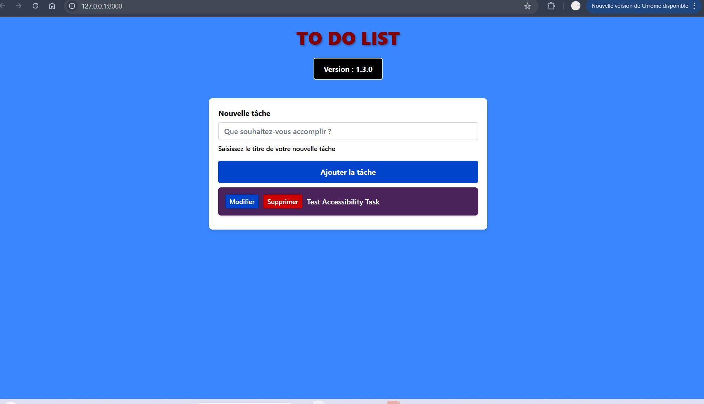

# To-Do List Application

Application de gestion de tâches développée avec **Django** et conçue pour être accessible (WCAG 2.1 AA), responsive et prête pour la production.

## Sommaire

1. [Aperçu](#aper%C3%A7u)
2. [Captures d'écran](#captures-d%C3%A9cran)
3. [Fonctionnalités](#fonctionnalit%C3%A9s)
4. [Accessibilité (WCAG 2.1 AA)](#accessibilit%C3%A9-wcag-21-aa)
5. [Installation](#installation)
6. [Utilisation](#utilisation)
7. [Tests et Qualité](#tests-et-qualit%C3%A9)
8. [Conventions de versionnement](#conventions-de-versionnement)
9. [Scripts utiles](#scripts-utiles)
10. [Technologies](#technologies)
11. [Contribution](#contribution)


---

## Aperçu

Cette application To-Do permet de créer, modifier, supprimer et lister des tâches. Elle met l'accent sur l'accessibilité : navigation clavier, attributs ARIA, contraste standardisé et tests automatisés WCAG.

---

## Captures d'écran

Affichage principal (liste des tâches) :



Formulaire de modification d'une tâche :


Confirmation de suppression :


> **Remarque :** chacune des images inclut un texte alternatif descriptif pour compatibilité lecteurs d'écran.

---

## Fonctionnalités

* **Créer** des tâches (titre, description, priorité, date d'échéance)
* **Modifier** les tâches existantes
* **Supprimer** avec dialogue de confirmation
* **API REST** minimale (endpoints CRUD) — optionnel selon configuration

---

## Accessibilité (WCAG 2.1 AA)

Principes mis en place :

* Ratio de contraste minimum **4.5:1** pour tout texte normal.
* Navigation **100% clavier** : tous les contrôles accessibles via Tab / Shift+Tab, et actions activables par Entrée/Espace.
* Attributs **ARIA** significatifs (role, aria-label, aria-describedby) sur composants interactifs.
* Focus visuel clairement visible (outline non supprimé, styles visibles).
* Structure HTML5 sémantique (header, main, nav, form, footer, etc.).
* Tests automatisés avec **Pa11y** et scripts de contrôle.
* Tests manuels recommandés : NVDA, VoiceOver, Lighthouse Accessibility.

**Exemples concrets dans le code :**

* `button` de suppression avec `aria-label="Supprimer la tâche <titre>"`
* Formulaires avec `label for` et `aria-describedby` pour messages d'erreur
* Rôles `role="alert"` pour messages dynamiques

---

## Installation

### Prérequis

* Python 3.8+
* Pipenv
* Node.js (pour outils d'accessibilité et scripts)

### Installation locale

````bash
# Cloner le dépôt
git clone <url-du-projet>
cd to-do-list--dirty

# Installer dépendances et ouvrir l'environnement virtuel
pipenv install
pipenv shell

# Appliquer les migrations
pipenv run python manage.py migrate

# Charger les données d'exemple (si dataset.json présent)
pipenv run python manage.py loaddata dataset.json

# Lancer le serveur local
pipenv run python manage.py runserver
```bash
# Cloner le dépôt
git clone <url-du-projet>
cd to-do-list--dirty

# Installer dépendances et ouvrir un shell virtuel
pipenv install
pipenv shell

# Appliquer les migrations
pipenv python manage.py migrate

# Charger les données d'exemple (si dataset.json présent)
pipenv python manage.py loaddata dataset.json

# Lancer le serveur local
pipenv python manage.py runserver
````

### Variables d'environnement recommandées

* `DJANGO_SECRET_KEY` — clé secrète
* `DJANGO_DEBUG=false` en production
* `DATABASE_URL` — si utilisation d'une DB externe

---

## Utilisation

### Créer une tâche

1. Cliquer sur **Nouvelle tâche** ou accéder à `/tasks/new/`.
2. Remplir le formulaire (Titre requis, Description optionnelle).
3. Valider par **Entrée** ou clic.

### Modifier une tâche

* Depuis la liste, cliquer sur **Modifier** (ou utiliser le raccourci clavier accessible). Voir capture : `V2.png`.

### Supprimer une tâche

* Cliquer sur **Supprimer** puis confirmer via la fenêtre modale. Voir capture : `V3.png`.

### Importer dataset

* Placer `dataset.json` à la racine du projet.
* Lancer :

```bash
python manage.py loaddata dataset.json
```

Assurez-vous que le fixture respecte le format Django JSON fixtures.

---

## Tests et Qualité

### Tests unitaires & couverture

```bash
# Lancer tous les tests
pipenv run python manage.py test

# Vérifier la qualité du code
pipenv run flake8 .

# Mesurer la couverture
pipenv run coverage run --source='tasks' manage.py test
pipenv run coverage report
```

### Tests d'accessibilité

```bash
# Exécuter les tests automatisés WCAG
a ./accessibility_check.sh

# Outils supplémentaires
# Pa11y (audit automatisé)
pa11y http://localhost:8000
```

### CI/CD

* Scripts de build exécutent tests unitaires, lint, coverage et Pa11y.
* Valeurs bloquantes : échec des tests ou coverage < seuil défini.

---

## Conventions de commits

Nous utilisons **Conventional Commits** :

* `feat:` nouvelle fonctionnalité
* `fix:` correction
* `docs:` documentation
* `test:` tests

Exemples:

```bash
git commit -m "feat: ajouter la suppression des tâches"
```

---

## Scripts utiles

* `./build.sh <version>` — build complet (tests + lint + packages)
* `./accessibility_check.sh` — exécute Pa11y et règles WCAG
* `./debug_contrast_homepage.sh` — script d'aide pour vérifier le contraste

---

## Technologies

* **Backend** : Django 4.2+
* **Frontend** : HTML5, CSS3, Bootstrap 4.3
* **Tests** : Django Test Framework, Pa11y, Lighthouse
* **Qualité** : Flake8, Coverage
* **Accessibilité** : WCAG 2.1 AA, ARIA

---

## Métriques

| Critère           | Résultat            |
| ----------------- | ------------------- |
| Couverture code   | 100 %               |
| Accessibilité     | WCAG 2.1 AA (100 %) |
| Qualité PEP8      | Conforme            |
| Tests automatisés | 20+                 |

---

## Contribution

1. Fork du dépôt
2. Créer une branche :

```bash
git checkout -b feature/<NomFeature>
```

3. Commit et push :

```bash
git commit -m "feat: description"
git push origin feature/<NomFeature>
```

4. Ouvrir une Pull Request

## Dépannage

### Problèmes liés aux versions de Django et CGI/WSGI

Certaines erreurs ont été rencontrées en raison d'incompatibilités entre les versions récentes de Django et la gestion des interfaces **CGI / WSGI / ASGI**.

#### Symptômes observés

* Erreurs lors du démarrage du serveur (`runserver`).
* Messages indiquant des modules manquants ou obsolètes liés à `cgi`.
* Incohérences entre les composants ASGI/WSGI selon la version de Django installée.

#### Cause

Les versions récentes de Django ont progressivement supprimé ou modifié certaines dépendances internes héritées de l’ancien module Python `cgi`. Cela entraîne des erreurs si un environnement contient :

* des restes d'une ancienne version de Django,
* des dépendances non synchronisées,
* un environnement virtuel qui n'a pas été complètement recréé.

#### Solution mise en place

1. Suppression complète de l'ancien environnement :

   ```bash
   rm -rf ~/.local/share/virtualenvs/*
   ```

2. Réinstallation propre via Pipenv :

   ```bash
   pipenv --rm
   pipenv install --dev
   ```

3. Forçage d'une version stable et compatible de Django:

   ```bash
   pipenv install "django>=4.2,<4.3"
   ```

4. Vérification et nettoyage des modules internes :

   ```bash
   pipenv run python -m django --version
   pipenv run python manage.py check
   ```

Après cette série d’actions, les erreurs liées à CGI/WSGI ont disparu et le projet a retrouvé un comportement stable.

---

## Statut

* **Version 1.3.0** finalisée
* Conformité WCAG 2.1 AA
* Tests automatisés intégrés
* Interface responsive

---

### Contact

Pour toute question ou rapport de bug, ouvrir une issue sur le dépôt GitHub.

-
